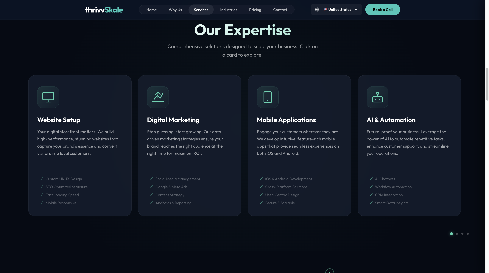
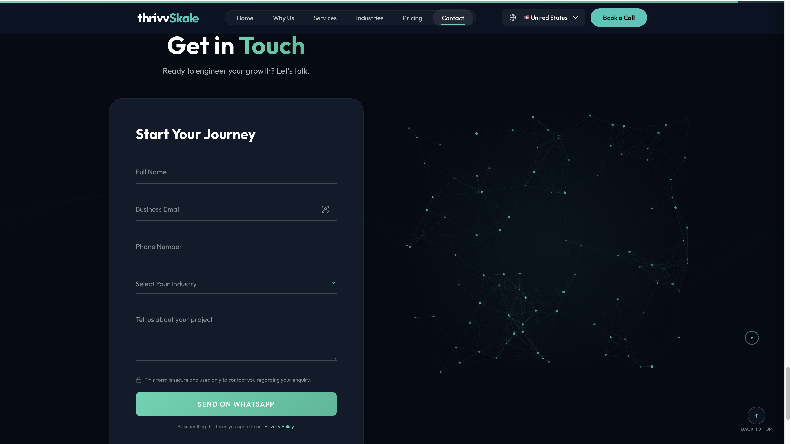

# ThrivvSkale — React Business Website & Lead Capture Platform

ThrivvSkale is a modern React/Vite frontend application built for a digital services business. It showcases a responsive landing page, reusable UI components, animated sections, contact form validation, and an interactive AI-style lead assistant workflow.

I selected this project because it demonstrates practical frontend development skills including component-based architecture, user experience design, form handling, state management, responsive layouts, and clean project organization.

## Live Demo

Coming soon

## GitHub Repository

https://github.com/Saikrant/thriveskale

## Tech Stack

- React
- Vite
- JavaScript
- React Router
- CSS
- ESLint
- Vitest

## Key Features

- Responsive landing page
- Reusable React components
- Hero, services, pricing, FAQ, contact, and navigation sections
- Interactive AI-style assistant workflow
- Contact form with validation and loading states
- WhatsApp lead handoff
- Smooth animations and user interactions
- Clean frontend folder structure
- Tested utility functions for validation, lead scoring, service recommendation, and WhatsApp handoff

## Screenshots

### Home Page

### Services Section

### Contact / AI Assistant

## Frontend Skills Demonstrated

- Component-based UI development
- React state management using hooks
- Form validation and error handling
- Conditional rendering
- Responsive design
- User flow design
- Clean code organization
- Vite project setup
- Frontend testing with Vitest

## Project Structure

thrive-skale-web/
- public/
- src/
  - components/
  - context/
  - utils/
  - App.jsx
  - main.jsx
- package.json
- README.md

## Main Components

### AIAgent

The AI Agent component provides an interactive lead-capture experience. It uses React state, message history, user input handling, typing states, and workflow-based responses to guide users through service recommendations.

### Contact

The Contact component handles user input, validation states, loading behavior, and lead handoff. It demonstrates practical form handling and user feedback patterns.

### Hero, Services, Pricing, FAQ

These components create the main landing page experience. They are structured as reusable sections to keep the UI maintainable and scalable.

## How to Run Locally

1. Go to the app folder:

   cd thrive-skale-web

2. Install dependencies:

   npm install

3. Start the development server:

   npm run dev

4. Open the local URL shown in the terminal, usually:

   http://localhost:5173

## How to Build

cd thrive-skale-web
npm run build

## How to Run Tests

cd thrive-skale-web
npm test

## Current Verification

- Build passes successfully
- Test suite passes successfully: 19 tests across 5 test files
- Lint command completes successfully
- npm audit reports 0 vulnerabilities

## What I Focused On

I focused on creating a polished frontend experience with clean navigation, reusable components, responsive layouts, smooth interactions, practical business-focused user flows, and tested utility logic.

## Future Improvements

- Add backend API integration for lead storage
- Add email notification support
- Improve accessibility testing
- Add more tests for form validation and workflow logic
- Add analytics for user interaction tracking
- Deploy production version with a custom domain
